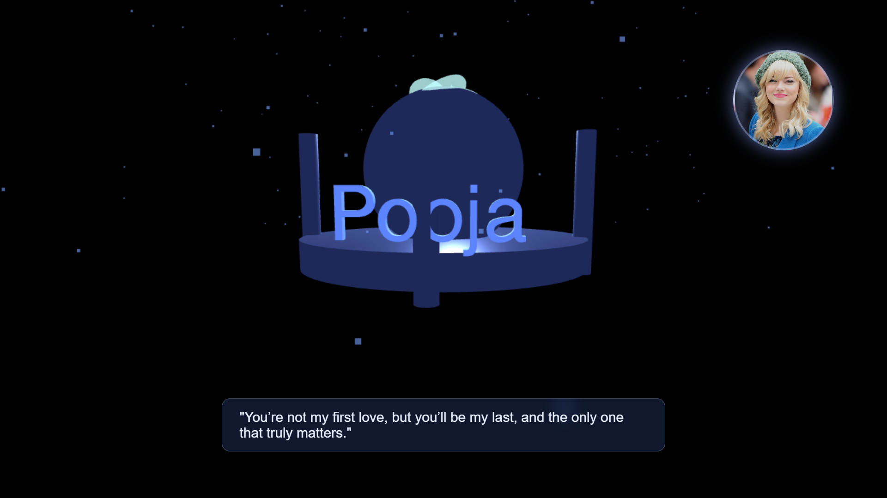
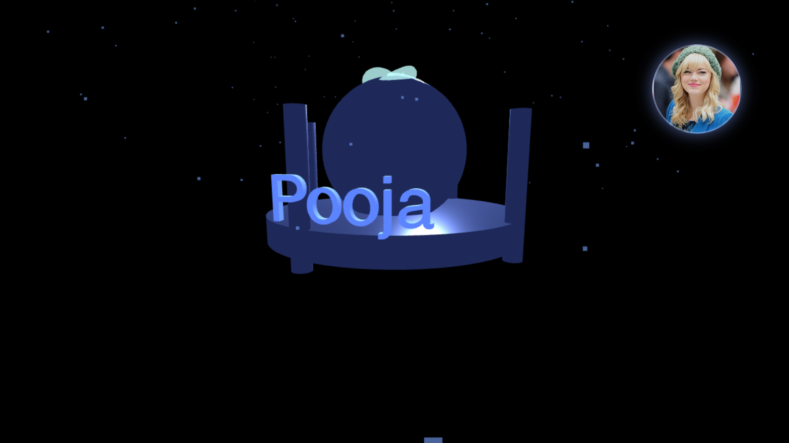
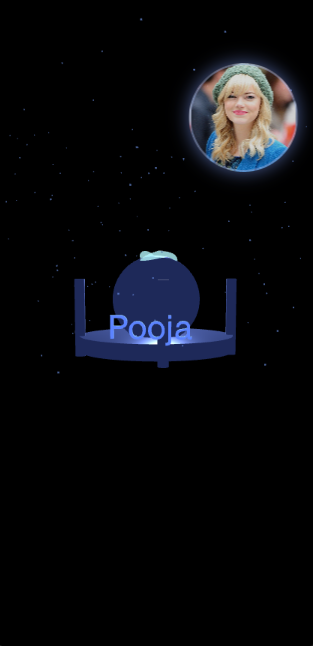
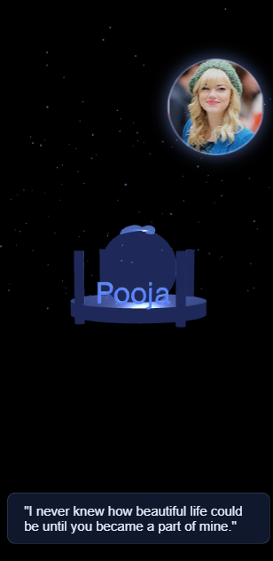
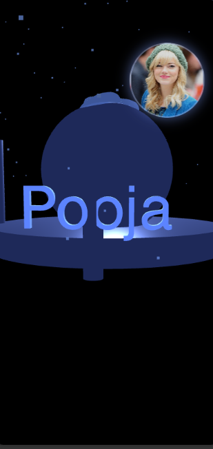
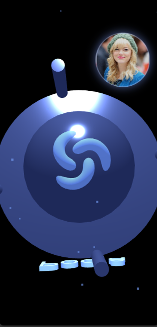
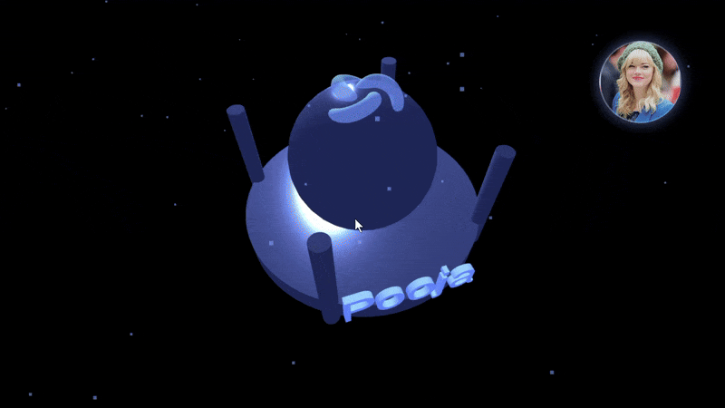
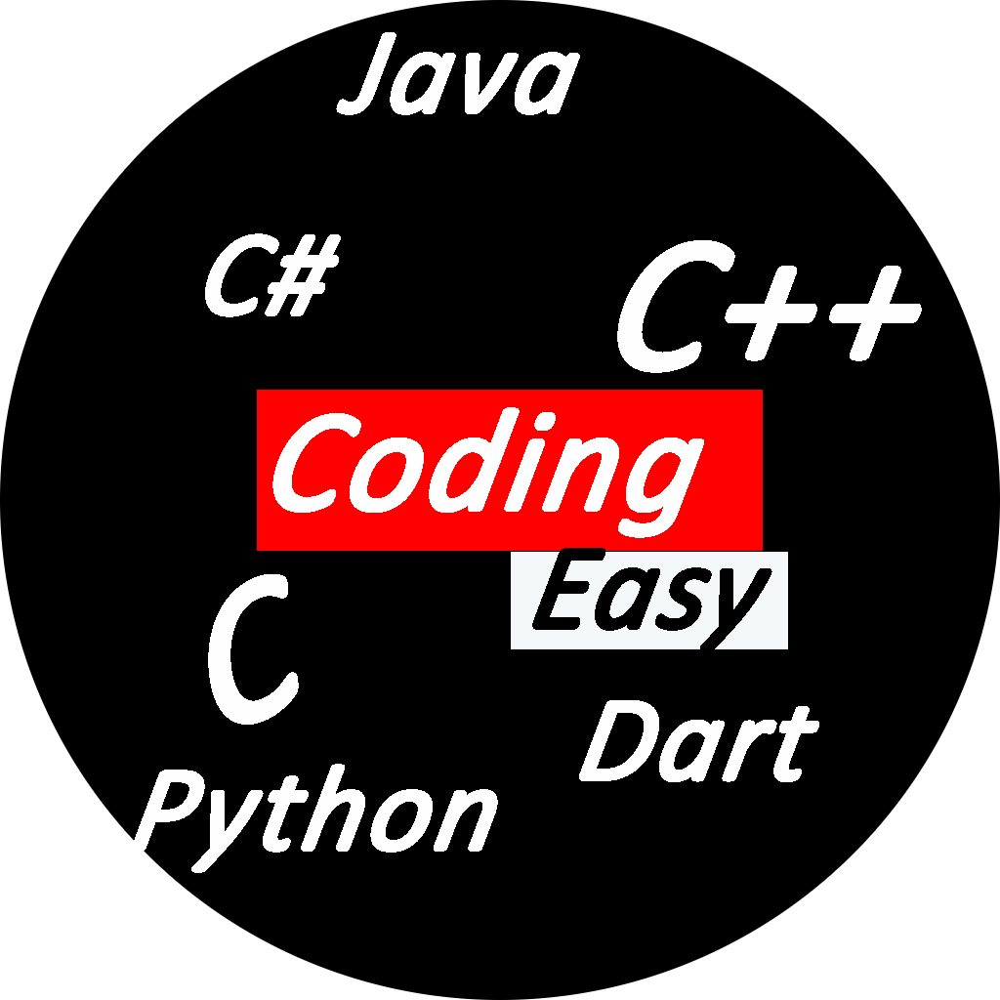

# Taj Mahal : A Monument of Love ❤️🏛️

A digital monument created to celebrate **endless love**.

_The hardest things to express are love and infinity. So I coded them both. ❤️_

This interactive 3D web experience features a sculpted Taj Mahal in an infinite, starlit space, personalized with your loved one's name. Inspired by the dedication Shah Jahan to Mumtaz Mahal, this project is a modern, digital testament to your devotion.

## 🚀 Live Demo

[🎬 Launch the Monument](https://arundada9000.github.io/tajmahal/)

---

## ✨ Key Features

- **3D Interactive Model:** A somewhat similar shaped, sculpted Taj Mahal monument.
- **Personalization:** Your loved one's name is dynamically rendered and sculpted onto the monument.
- **Endless Space:** The 3D scene is set in an infinite void, mirroring the concept of endless love.
- **Intuitive Controls:**
  - **Rotation:** Rotate the monument infinitely to view it from any angle.
  - **Zoom:** Zoom in and out without limit.
- **Randomized Quotes:** Tapping or clicking anywhere on the screen triggers a randomly selected quote (from a collection of 40) to be displayed at the bottom, adding an element of surprise and intimacy.

---

## 💻 Desktop Preview

---

## 📱 Mobile Preview

---

## 🛠️ How to Customize It

You can easily personalize this monument for your own love story by making small changes in the main script file.

### 💖 1. Change the Name

1. First of all inside the index.html file search for any name with Pooja and replace it with your own.

1. Open the main Script file (`script.js`).
1. Near the top of the file, locate the default name (`Pooja`) and replace it with the name you wish to use.

✅ **Result:** The sculpted name and the personalized quotes will automatically update to reflect the new name.

---

### 💞 2. Add or Remove Quotes

The project includes a collection of 40 quotes, but you can tailor them to your own relationship:

1.  In `script.js`, find the `const quotes = [\`...\`]` array.
2.  Remove any quotes you don't like or add your own custom messages to the array.

---

### 🖼️ 3. Change the Background Photo

1.  Go inside assets and copy paste your new image.
2.  Delete the existing image1.jpg and rename your new photo as image1.jpg .
3.  Done

---

## 🌸 Preview of the Animation

This endless, interactive space serves as a constant reminder of your bond.

---

## 🌐 Connect with Me

I'm always happy to collaborate on creative and fun web projects! Let’s connect 👇

---

### Attribution & Usage

_Crafted with a whole lot of feelings, and designed for endless contemplation. Just like love, this code reaches for the stars. ✨_

- **Creator:** **Arun Neupane**
- **Educational Source:** This project was developed for **educational purposes** on the **Code With Ease** YouTube channel.
- **Tutorial:** **[Watch the full tutorial on YouTube](https://youtu.be/7KCuwz16qAU)**
- **Channel:** **[Code With Ease Channel](https://youtube.com/@arundada9000)**

---

### ⚠️ Licensing & Reuse

I hereby declare that **anyone can use this code freely** for their own personal projects. However, the following assets are **not for reuse or redistribution** in other projects:

- **Images/Previews**
- **Music** (if applicable)
- **Personal Names** (used in the default configuration)

  <i>© 2025 Arun Neupane — All rights reserved for images, music, and personal assets.</i>

_Made with ❤️ and sculpted in digital marble. Sometimes, the most beautiful words are built, not spoken. 🏛️_
